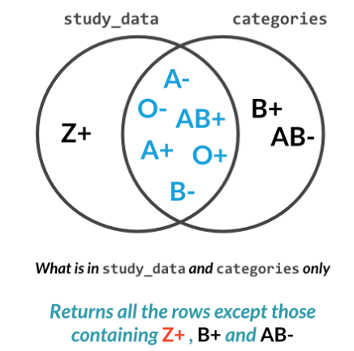

# Cleaning Data in Python

## Chapter 1
## Common Data Problems

<b>Why do we need to clean data?</b><br>
<b>Answer:</b> Duplicate Values, Different spellings for the same word, Data Parsing etc/ may cause the data to become 'dirty' and if not cleaned the reports and insights generated from that data becomes compromized.

We also need to make sure that our variables have the correct data types. For example, integers in a data frame may be stored as strings.

### Converting strings to integers

Consider a column in a table which is supposed to contain integers but contains strings such as :- '123@456@789'.
To convert the column value strings to an integer we would first need to use the ```.strip()``` method to remove the character '@'.

```python 
table['column name']  = table['column name'].str.strip('@')
```

Now we can convert the resulting column values back to an integer.

```python
table['column name'] = table['column name'].astype('int')
```

### Numerical or Categorical

Consider the column 'Marital Status' which has responses 0 or 1. Now both these numbers may be of the type integer but they represent two different categories. If the data type is treated as an integer, than the statistics of the column will give us unusual results. 

To treat these integers as categories we need to convert the column from ```integer``` data type to ```category``` data type.

```python
table['marital_status'] = table['marital_status'].astype('category')
```

To confirm the change it is good practise to ```assert``` the change.

```table['marital_status'].dtype == 'category'```

### Data information

- To get information related to the entire data frame we use ```df.info()```.

- To get summary statistics of individual columns in the data frame we use ```df['column name'].describe()```.

### Uniqueness contraints

#### Dropping data

It is important to note, that data should only be dropped when it is affecting a small set of out-of-range values. Dropping may result in loss of essential data. Hence, it should only be used when absolutely necessary.

##### How to drop data

1. <b>Filtering data</b>
Data can be dropped by applying simple masks/filters.
For example:-

```python
new_df = old_df[old_df['avg_rating'] < 5]
```

2. The ```.drop()``` method
We can also use the ```.drop()``` function to drop junk values.

```python
df.drop(df[df['avg_rating'] < 5].index, inplace = True)
```
To check if the drop has been made successfully we can use assertions.

```python
assert df['avg_rating'].max() <= 5
```

#### Replacing values

We can use the ```.loc[]``` location indexing method to replace values in the data frame.

```python
#         row argument        col argument
df.loc[df['avg_rating'] < 5, 'avg_rating'] = 5
assert df['avg_rating'].max() < 5
```

#### Date range example

Consider a data frame that has faulty dates, of registration that are greater than the present date. We would want to fix/remove those values.

To do so we first need to convert the pandas object value into a ```datetime``` data type.

```python
df['sub_date'] = pd.to_datetime(df['sub_date']).dt.date
assert df['sub_date'].dtype == 'datetime'
```

##### Replacing dates in a data frame

If the dates column contains dates that are in the future, they need to be replaced or dropped. One solution to deal with this is to replace the dates with the current date.   

<b>Convert</b>

First we need to convert the date variable to a datetime object. If the variable is a type string then the replacement process will not work.

```python
df['date'] = pd.to_datetime(df['date']).dt.date
```

<b>Compare and Replace</b>

We then compare all the entries in the date column with the current date.

```python
df.loc[df['date'] > dt.date.today(), 'date'] = dt.date.today()
```


#### Duplicate data

##### Looking for duplicate values - the .duplicated() function

<b>Arguments</b>

- <b>subset</b>

> ```subset``` is the list of column names to check for duplication.

```python
columns = ['first', 'second', 'third']
duplicates = df.duplicated(subset = columns)
df['duplicates']
```
- <b>keep</b>

> ```keep``` is used to speciy which instances of the duplicated values to retain. Whether if its the <b>first</b> ('first'), <b>last</b> ('last'), or <b>all</b> ('False') duplicate values.


```python
duplicates = df.duplicated(subset = columns, keep = False)
df['duplicates']
```

##### Dropping duplicate data - the .drop_duplicates() method

This function drops <b>complete duplicates</b> only.
<br>
<b>Complete duplicates</b> are those that match across all attributes unlike <b>Incomplete duplicates</b> that may not be matching on atleast 1 of the fields.

<br>Instead of dropping incomplete duplicates, we can choose to combine them. For example, if the mis-match occurs at a numerical value we can use statistical measure, such as the mean, max or min to combine that numerical value and use it across all the attributes.


The ```.drop_duplicates()``` takes the same areguments, ```keep``` and ```subset```. 

It also takes an additional argument ```inplace``` which drops duplicated rows directly inside the DataFrame without creating new object if it is set to ```inplace = True```. <br>

### Combining two data frames

We can use the ```.agg()``` function to aggregate two series togther. 
We can initialize a new dictionary, and add it to the end of a pandas dataframe by using the stated fucntion.
```python 
df.agg(new_dict)
```

## Chapter 2
## Text and Categorical data
Categorical data represents data with predefined categories.
To run machine learning algorithms on categorical data, they are coded as integers and not strings. They cannot have values beyond the specified categories. 

Various phases involved with the handling of data may cause inconsistencies amongst categorical data. We can deal with these problems in various ways, such as the ones stated below:

<ol>
    <li style="color:red"> Dropping data</li>
    <li style= "color:yellow"> Remapping Categories</li>
    <li style="color:lightgreen"> Inferring Categories</li>
</ol>

### Finding inconsistent data

<h4>Example</h4>
Given that we have two sets of data:
- study_data: containing records of blood groups of various patients.
- categories: which contains the accepted blood groups/types.

<br>Now Consider the diagram below.
We essentially have 3 sets of data.<br>
<ol>
    <li>The left section: containing data that is found in the data set but not in the categories dictionary. 
    <li>The inter-section: containing the blood groups that are found both the in the study_data and the categories dictionary.
    <li>The right section: containing data from the categories dictionary. 
</ol>
Essentially the data in the left section, that is present in our data set is the one we want to get rid of because it is faulty data.
The left section contains categories of blood groups that were not found in the accepted categories dictionary. 



To get the data that corresponds to the left-most section:

```python
unacceptable_data = set(study_data['blood_type']).difference(categories['blood_type'])
```
The above piece of code will return the left-most section, the categories we want to remove, i.e. 'Z+' from the data frame that contains our raw data.

Now that we have the categories that we want to remove, we need to get the rows that contain the inconsistent blood group categories.

```python
rows_containing_inconsistent_data = study_data['blood_type'].isin(unacceptable_data)
inconsistent_data = study_data[rows_containing_inconsistent_data]
```
To return only the data that is consistent, we simply use the ```tilde sign (~)```.

```python
consistent_data = study_data[~rows_containing_inconsistent_data]
```

<mark style="background:red; color:yellow">Note:</mark><br>Categorical data has value membership constraint.

### Categorical variables

We may encounter certain types of errors when dealing with categorical data.
1. Value inconsistency
- Inconsistent fields
    - married
    - Married
    - Maried
- Trailing white spaces
    - 'Married'
    - ' Married'
    - 'Married '
2. Improper categories
- Creating new groups, ```0-20k```, ```20k-40k``` categories from continuous data.
- Improper mapping: The mapping below is an example of an improper mapping.  
    - 1-5 &rarr; bad 
    - 5-10 &rarr; good<br>

- The above mapping can be improved
    - 1-5 &rarr; bad 
    - 5-9 &rarr; neutral
    - 10-10  &rarr; good

Before we start working on catagorical data we need to make sure that our categories are consistent. Not doing so may lead to somewhat inconsistent results.

It is always a good idea, to use the ```value_counts()``` function to have a look at all the categories that are related to a certain column. 

### Creating categories from raw data

Instead of manually dividing the data into categories it is always a good idea to make use of libraries. 

#### <b>Example Code</b>

<b>The ```qcut()``` function</b>

```python
import pandas as pd
group_names = ['0-20k', '20k-40k', '40k+']
df['income_group'] = pd.qcut(df['income'], q = 3, labels = group_names)
```
In the above mentioned function we did not tell ```qcut()``` where our ranges lie .

<b>The ```cut()``` function</b>

```python
import pandas as pd
import numpy as np

ranges = [0, 200000, 200000, np.inf]
group_names = ['0-20k', '20k-40k', '40k+']

df['income_group'] = pd.cut(df['income'], bins = ranges, labels = group_names)
```

We may also at times need map more categories to fewer categories.
In this case we will need to create an m &rarr; n mapping where n < m.

```python
in_put = ['microsoft', 'macos', 'ios', 'android', 'linux']
out_put = ['desktopOS', 'mobileOS']

mapping = {'microsft': 'desktopOS', 'macos': 'desktopOS', 'ios': 'mobileOS', 'android': 'mobileOS', 'linux': 'desktopOS'}

df['os'] = df['os'].replace(mapping)
```

### String formating

When working with string literals, at times the data will require formatting. 
We might need to deal with white space, or mixed cases.

1. It is better to first convert all the data to lower case before we start the processing.

```python
df['data'] = df['data'].str.lower()
df['data'] = df['data'].str.upper()
```

2. It is also important to remove white spaces in the data that might lead to inconsistencies later on.

```python
df['data'] = df['data'].str.strip()
```

### Cleaning text data

1. Removing unwanted symbols from string data.<br>
Consider we have a phone number such as '+44-123456'.<br>
We know that the + symbol represents '00'.
We now want to replace the '+' sign with '00' to convert it into an actual working number. 
We can use the ```.replace()``` method to do so.
```python
data_frame['phone_number'] = data_frame['phone_number'].str.replace('+', '00')
```

2. If we have data that is inconsistent with the rest of the data inside the column, we may choose to replace it with ```nan``` or anyother marker/symbol. Todo so we can make use of the ```.loc``` function.
```python
length = data_frame['phone_number'].str.len()
data_frame.loc[length < 10, 'phone_number'] = np.nan
```

To test if the changes have been applied we can make use of the assert statements.

```python
length = df['phone_number'].ste.len()

assert length.min() >= 10
assert df['phone_number'].str.contains("+|-").any() == False
```
<b>The ```.any()``` method</b><br>
The ```.any()``` method returns true if any element of the our output from ```.str.contains()``` is ```True```.

### Regex

<b>Example Code</b>

```python
data['number'] = data['number'].str.replace(r'\D+', '')
```
The regular expression tells pandas to replace anything that is NOT a digit with nothing. The + sign means atleast 1.

### Useful code snippets

- The following code is used to assert changes made to an entire data frame column. It checks if the column 'full_name' has any honorifics in any of its entires.

```python
assert airlines['full_name'].str.contains('Ms.|Mr.|Miss|Dr.').any() == False
```


## Chapter 3 
## Advanced data cleaning problems

### Uniformity

#### Unit Uniformity

We can use various kinds of plots of our data to find out which values are the odd one out. We need to make sure that all the values that we are dealing with have the same units. 

##### Example 

Consider an example of daily temperature of a city being collected.

Readings of temperature may occur in both Celcius and Farhenhiet when entering the data into the records.

After making a plot of the data, we realize that 10 out of 100 values are very different to the rest of the values and we infer that the reading are the ones in Farhenhiet. 

We now need to convert these readings and place them back into the data frame.

$C = (F - 32) \times 5/9$

```python
temperature_f = df.loc[df['temperatures'] > 40, temperatures]
converted = (temperature_f - 32) * (5/9)
df.loc[df['temperatures'] > 40, temperatures] = converted
assert df['temperatures'].max() > 40
```

### Formatting dates

To deal with date and time related formating we use ```pandas.to_datetime()```. 

To process dates we need to convert the string-date column to a date time object.

```python
df['date'] = pd.to_datetime(df['date'], infer_date_time = True, errors = 'coerce')
```

Setting the ```errors``` argument to ```coerce``` the date column will have ```NA``` for columns where the conversion had failed, instead of a value error.

We can also choose to convert the date to the format of our choice using the followig code.

```python 
df['date'] = df['date'].dt.strftime("%d-%m-%y")
```

### Cross field validation


## Chapter 4
